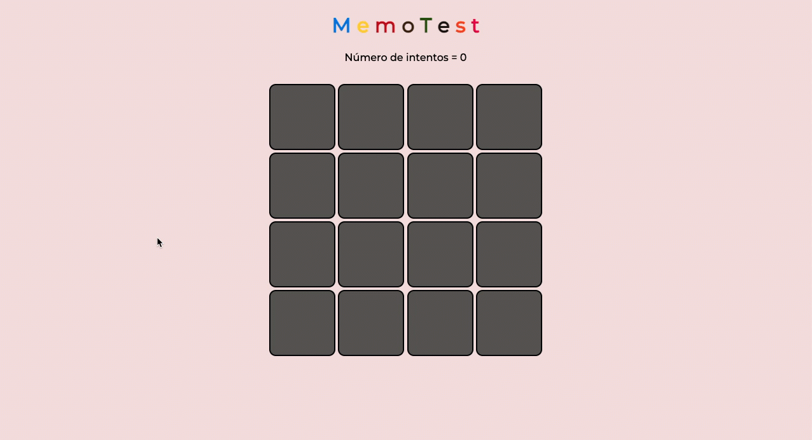

# Monopoly Game

## Description

This repository contains a memory game known as **Memo Test** built with vanilla JavaScript. The user must find the 8 pairs of tiles in the fewest number of attempts. This is one of the firsts games I built.

## Live version
To see a live version of this project, visit [this link](https://vlaurencena.github.io/memory-game/).

## Built with
* HTML
* CSS
* JavaScript

## Running locally

1. Clone the repository to your local machine by running the following command in your terminal:

```bash
git clone https://github.com/vlaurencena/memory-game
```
2. Navigate to the project folder by using the command:

```bash
cd memory-game
```

2. Open the `index.html` file in your preferred browser. You can do this by double-clicking the file or running the following command:

```bash
open index.html  # For macOS
start index.html # For Windows
xdg-open index.html # For Linux
```
